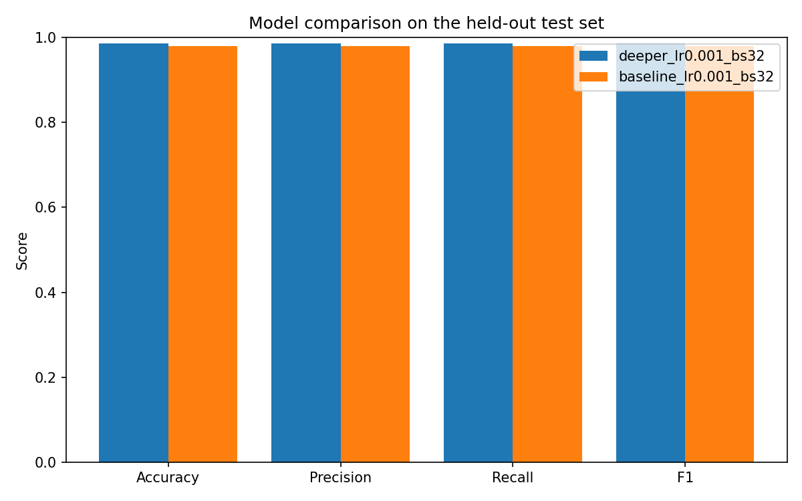

# PCB Defect Image Classifier

A convolutional neural network that classifies printed circuit board (PCB) defects into four categories: missing hole, spur, short, and open circuit. Built in PyTorch, with NumPy for image preprocessing and Pandas for logging results.

## Problem statement

Checking PCBs for defects by hand is slow and inconsistent. This project takes a cropped image of a defect on a PCB and classifies it into one of four defect types.

## Dataset

This uses the PKU-Market-PCB dataset (Huang & Wei, 2019, [arXiv:1901.08204](https://arxiv.org/abs/1901.08204)). It has 693 PCB photos with defects added in, labeled across 6 defect types with bounding boxes. This project only uses 4 of them: missing hole, spur, short, open circuit.

The dataset needs to be downloaded manually and placed in `data/raw/`. A few sources have it:

- HyperAI, https://hyper.ai/en/datasets/33973
- Kaggle, e.g. `akhatova/pcb-defects`
- GitHub, search "PKU-Market-PCB" or "PCB-DATASET"

Place the files like this:

```
data/raw/
    images/
        Missing_hole/*.jpg
        Spur/*.jpg
        Short/*.jpg
        Open_circuit/*.jpg
    Annotations/
        Missing_hole/*.xml
        Spur/*.xml
        Short/*.xml
        Open_circuit/*.xml
```

### Preprocessing

The raw images are full board photos with bounding-box annotations. `src/preprocessing.py` crops the defects out of the originals and builds the dataset used for training:

- crop each defect using its bounding box, with a bit of margin around it
- convert to grayscale
- resize to 128x128
- split into train/val/test
- save to `data/processed/<class>/` and `data/splits/*.csv`

## Installation

Requires Python 3.11 (developed and tested against it; should also work on 3.10+).

```bash
python -m venv .venv
source .venv/bin/activate        # Windows: .venv\Scripts\activate
pip install -r requirements.txt
```

PyTorch uses CPU automatically if no GPU is available, no CUDA toolkit needed.

## Preparing the dataset

After placing the raw dataset under `data/raw/` as described above:

```bash
python -m src.preprocessing
```

This writes cropped/labeled images to `data/processed/<class>/` and split manifests to `data/splits/{train,val,test,manifest}.csv`. Useful flags:

```bash
python -m src.preprocessing --classes missing_hole spur short open_circuit \
    --image-size 128 --margin 0.15 --val-frac 0.15 --test-frac 0.15 --seed 42
```

## Exploring the dataset

```bash
jupyter notebook notebooks/01_explore_dataset.ipynb
```

Covers class balance, train/val/test crop counts, a board-level split leakage sanity check, raw vs. processed image dimensions, and example crops per class.

## Training

```bash
python -m src.train --model baseline --epochs 25 --lr 0.001
python -m src.train --model deeper   --epochs 25 --lr 0.001
```

Configurable via CLI: `--model {baseline,deeper}`, `--epochs`, `--lr`, `--batch-size`, `--image-size`, `--seed`, `--patience` (early stopping, 0 disables), `--run-name`. Each run:

- Logs per-epoch `train_loss, val_loss, train_accuracy, val_accuracy, epoch_time` to `outputs/metrics/<run_name>_epoch_log.csv`.
- Saves the checkpoint with the best validation accuracy to `outputs/models/<run_name>_best.pt` (gitignored, regenerate by re-running training).
- Appends a summary row (hyperparameters + best val accuracy) to `outputs/metrics/training_runs.csv`.
- Stops early if validation loss hasn't improved for `--patience` epochs (default 6).

## Evaluating

```bash
python -m src.evaluate --run-name baseline_lr0.001_bs32
python -m src.evaluate --run-name deeper_lr0.001_bs32
```

Loads the run's best checkpoint, evaluates on the held-out **test** split (never touched during training), and writes:

- `outputs/metrics/<run_name>_test_report.csv`, per-class precision/recall/F1 (scikit-learn).
- `outputs/plots/<run_name>_confusion_matrix.png`
- `outputs/plots/<run_name>_training_curves.png` (train vs. val loss and accuracy)
- Upserts a row into `outputs/metrics/comparison.csv`.

## Comparing experiments

```bash
python -m src.compare
```

Merges each run's hyperparameters with its test metrics into `outputs/metrics/model_comparison.csv`, sorted by test accuracy, and plots `outputs/plots/model_comparison.png`.

## Results

| Model | Test Accuracy | Precision (macro) | Recall (macro) | F1 (macro) |
|---|---|---|---|---|
| Baseline CNN | 0.9789 | 0.9797 | 0.9795 | 0.9793 |
| Deeper CNN | 0.9860 | 0.9862 | 0.9862 | 0.9862 |



*Accuracy, precision, recall, and F1 for both models on the test split.*

- Deeper CNN scored slightly higher but took about 3x longer to train on CPU (~15 min vs ~5 min for 25 epochs) and needed early stopping, where the baseline didn't.
